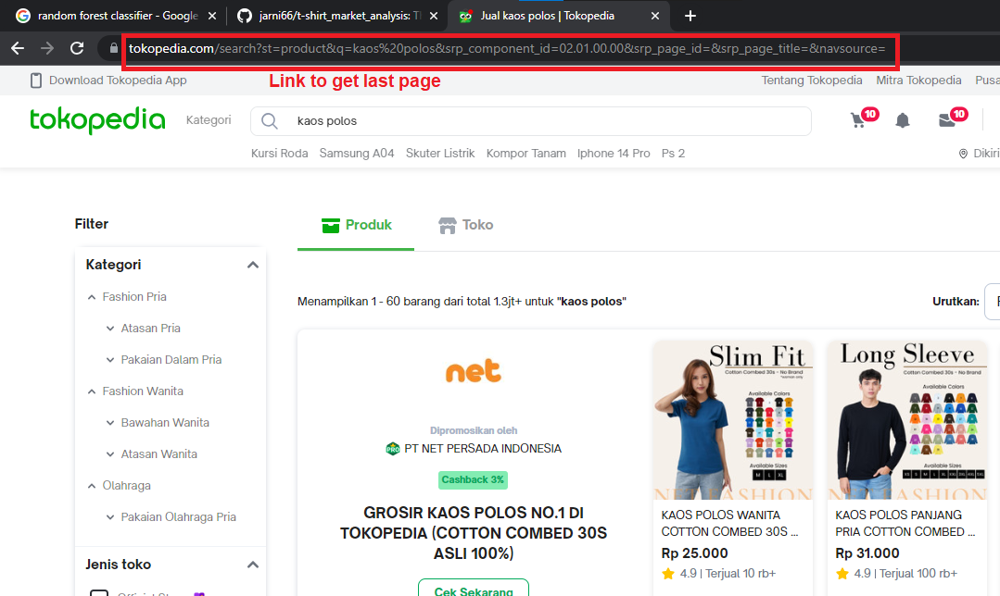
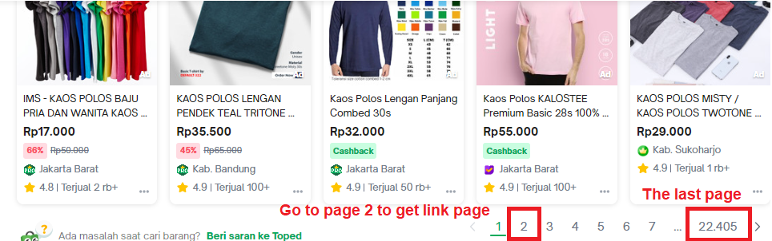
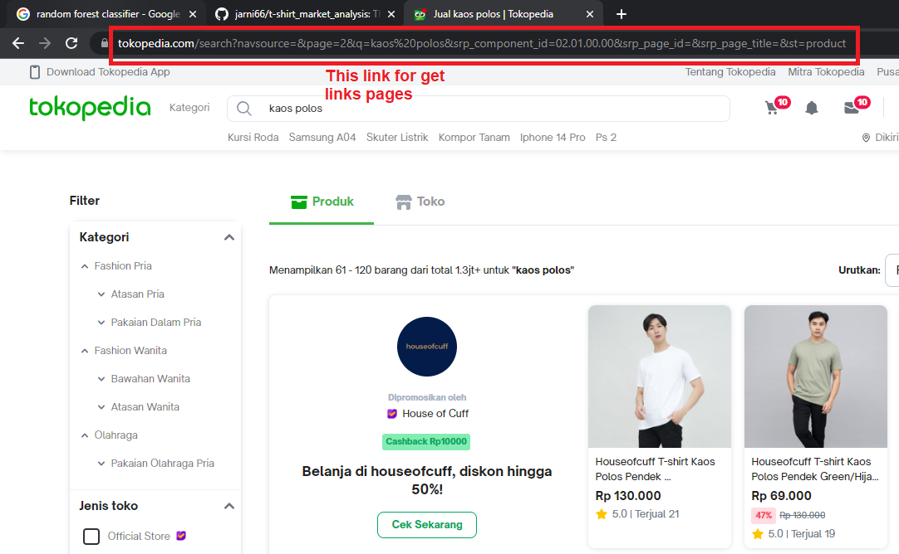

# About the project
There are many ways to research regarding on product market analysis, I try to do litle market analysis on t-shirt product just to know what is product are most sold, how the price, is there any intresting variable correlation in market place. With this analysis i believe it can be source of consideration in starting a clothing brand or launching t-shrit product.

But why t-shirt? here's why :
- Everyone is like at leats having t-shirt on daily basis right? it means t-shirt have broad market.
- T-shrit is cheap clothing item, everyone can buy it anyway.
- From business perspective t-shirt easy to produce

So i think this project is worth of time to do before starting your t-shirt business :wink:. 

## Built with
- [![Python][Python.com]][Python-url]
- [![VScode][VScode.com]][VScode-url]
- [![Jupyter][Jupyter.com]][Jupyter-url]
- [![Selenium][Selenium.com]][Selenium-url]
- [![BS][BS.com]][BS-url]
- [![pandas][pandas.com]][pandas-url]
- [![matplotlib][matplotlib.com]][matplotlib-url]
- [![seaborn][seaborn.com]][seaborn-url]

## Getting Started
To run this project you will need Visual Studio Code to run web scraping script and Jupyter notebook to run data exploratory.
## Prerequisites
These are some library you need to run the project, i put the pip installation to make it easy for you.

* Selenium
  ```sh
  pip install selenium
  ```
* BeautfulSoup
  ```sh
  pip install beautifulsoup4
  ```
* Pandas
  ```sh
  pip install pandas
  ```
* Matplotlib
  ```sh
  pip install matplotlib
  ```
* Seaborn
  ```sh
  pip install seaborn
  ```
* tqdm
  ```sh
  pip install tqdm
  ```
## Usage
This project divided in two steps, there are scraping and analyzing.
### Scraping
Scraping process is run in Visual Studio Code there are 2 python files:
- scrape_main.py
This file contains some function:
    - scr_last_page
    to get last page in search result 
    - scr_list_page
    create list of link for each page
    - scr_main
    get all product link
    - scr_sub
    get all product data properties
- scrape_launch.py
Here we looping to get all data using functions from scrape_main.py. Since the process take a lots of time we perform this process with pickle to save gathered data, and we can continue the process anytime. There are some pickle files here :
  - data_dict.pkl
    Data of gathered dictonary.
  - done_link.pkl
    List of gathered links.
  - fail_link.pkl
    List of failed links.
  - prod_link.pkl
    List of products url.

### Demonstration

Picture above is search result page

Picture above is bottom of the previous picture

Picture above is on the page 2


[Python.com]: https://img.shields.io/badge/python-000000?style=for-the-badge&logo=python&logoColor=white
[Python-url]: https://www.python.org/
[VScode.com]: https://img.shields.io/badge/vscode-000000?style=for-the-badge&logo=visual-studio-code&logoColor=white
[VScode-url]: https://code.visualstudio.com/
[Jupyter.com]: https://img.shields.io/badge/jupyter-000000?style=for-the-badge&logo=jupyter&logoColor=white
[Jupyter-url]: https://jupyter.org/
[Selenium.com]: https://img.shields.io/badge/selenium-000000?style=for-the-badge&logo=selenium&logoColor=white
[Selenium-url]: https://www.selenium.dev/
[BS.com]: https://img.shields.io/badge/Beautifulsoup-000000?style=for-the-badge&logo=&logoColor=white
[BS-url]: https://www.crummy.com/software/BeautifulSoup/bs4/doc/
[pandas.com]: https://pandas.pydata.org/
[pandas-url]: https://img.shields.io/badge/pandas-000000?style=for-the-badge&logo=pandas&logoColor=white
[matplotlib.com]: https://matplotlib.org/stable/index.html#
[matplotlib-url]: https://img.shields.io/badge/matplotlib-000000?style=for-the-badge&logo=matplotlib&logoColor=white
[seaborn.com]: https://seaborn.pydata.org/index.html
[seaborn-url]: https://img.shields.io/badge/seaborn-000000?style=for-the-badge&logo=seaborn&logoColor=white
